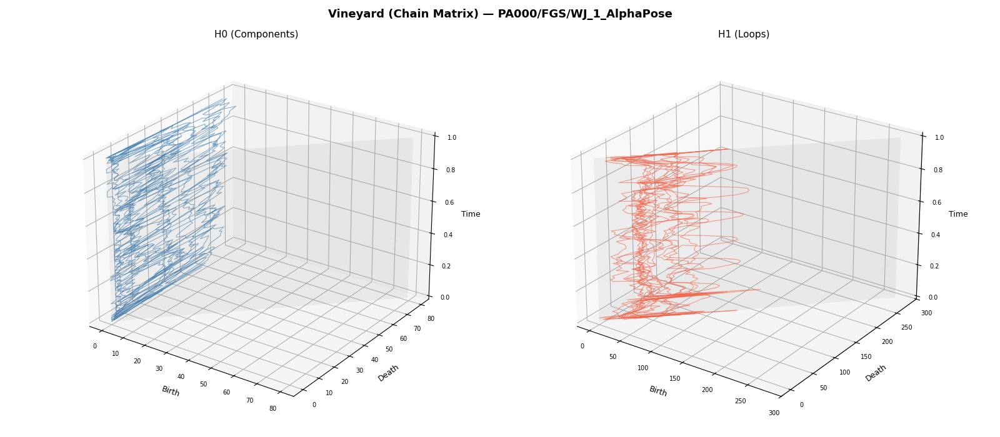
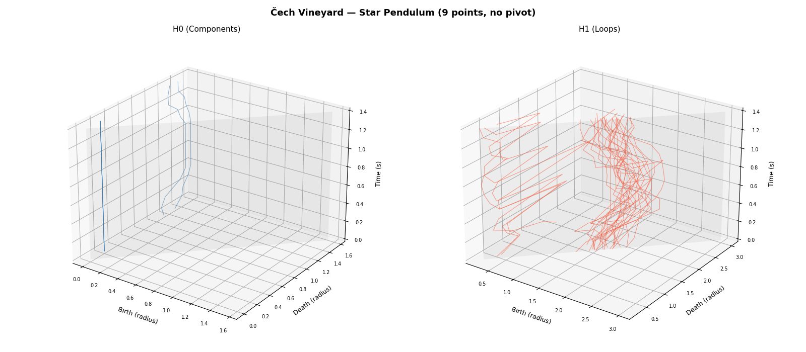
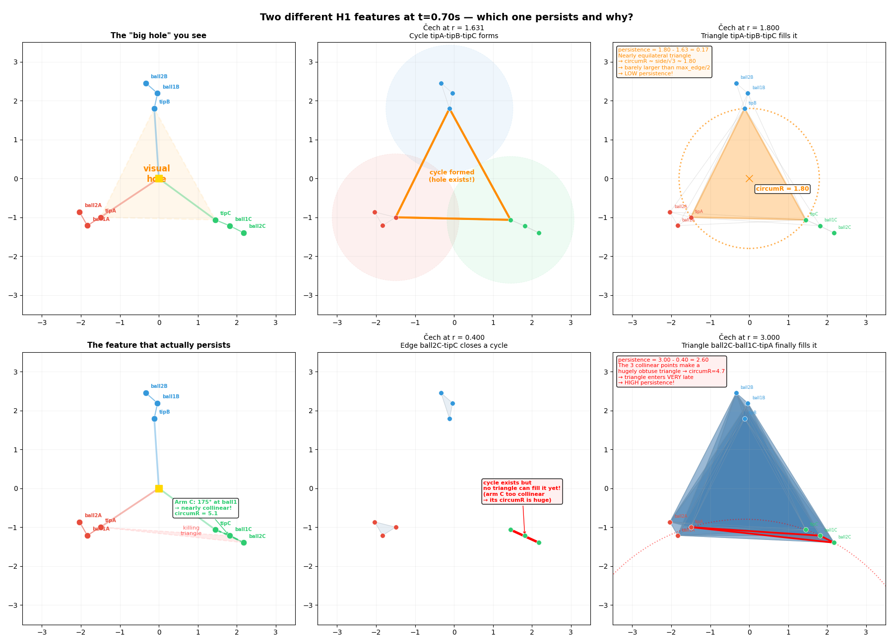
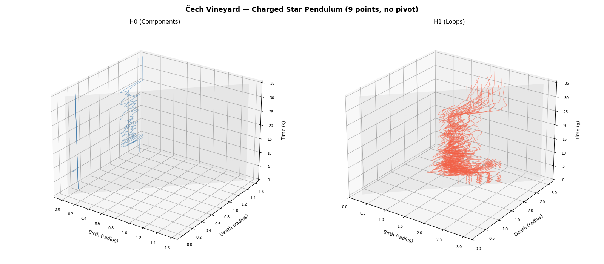
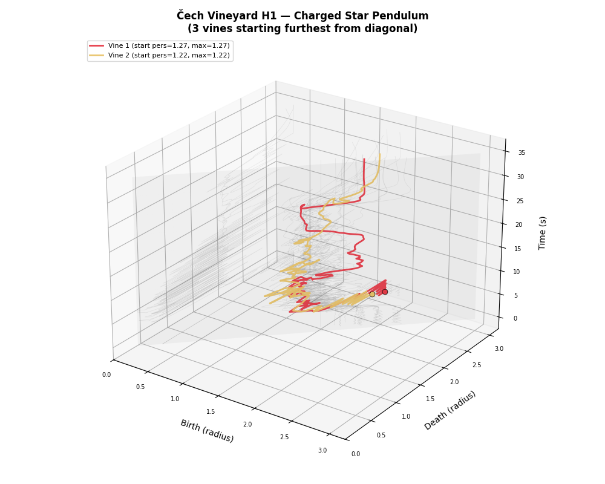
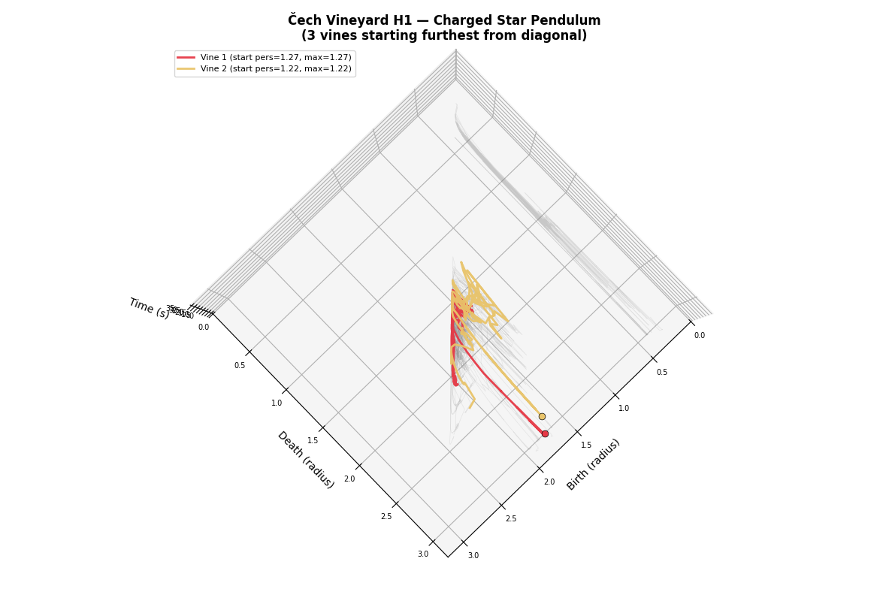

# Vineyards for Real Data and Chaos Systems

Searching for **monodromy** in persistence vineyards computed from physical dynamical systems.

## Motivation

A *persistence vineyard* tracks how the barcode (persistence diagram) of a point cloud evolves as the points move continuously through space, changing the filtration values of the underlying simplicial complex. Each bar traces a *vine* through (birth, death, time) space. If the point cloud returns to its starting configuration (forming a loop in configuration space), one can ask whether each vine returns to its starting point in the persistence diagram. **Monodromy** occurs when it does not. If *k* > 1 is the smallest number such that following a vine around the loop *k* times returns it to its starting point, the monodromy has **order *k***.

## What's in this repo

| File | Description |
|------|-------------|
| `test.ipynb` | Main notebook — all experiments, simulations, and vineyard computations |
| `vineyard_ext.cpp` | C++ pybind11 extension wrapping GUDHI's persistence `Matrix` with `vine_swap` |
| `vineyard_ext.*.so` | Compiled extension |
| `*.csv`, `*.npy` | Point cloud and simulation output data |
| `*.mp4` | Simulation videos |
| `images/` | Exported figures from the notebook |

## Journey

### 1. Gait data (abandoned)

We started with human gait pose-keypoint data, hoping the cyclic walking motion would produce interesting vineyard structure. Then we switched to simulating our own chaos system, so that we can get more control on the data points.



### 2. Single-bar chaos pendulum

Built a fast analytical simulation of a pivoting bar with two triple pendulums hanging off each end. This produced chaotic dynamics, but the Rips vineyard H1 features were all popping on and off the diagonal.


### 3. Three-rod star pendulum

Switched to a **3-rod star**: a central pivot (free rotation) with 3 rigid rods at 120°/0°/230°, each carrying a double pendulum. More points, richer topology.


Computed the **Čech vineyard** using GUDHI's chain matrix with vine_swap. The H1 features were dominated by collinear-arm configurations (large circumradius, leading to the hiher persistence) rather than the central hole.


<!--  -->

### 4. Charged star pendulum — monodromy found

To get a clean **closed loop** in parameter space (required for monodromy), we added **electrostatic charges**:
- Pivot charge `Q(t)`: starts high (balls stretched radially outward), ramps to 0 (free chaotic dynamics), ramps back up (balls return to outstretched positions)
- 6 ball charges: `q = +1` each, with mutual Coulomb repulsion
- Damping increases during the return phase to ensure wobble-free settling

This gives a parameter loop: the system starts and ends in the same stretched configuration, but the chaotic free phase in the middle scrambles the vine identities.




## Main result: monodromy in the vineyard

We tracked the H1 vines with the largest starting persistence (furthest from the diagonal at t=0). Following these vines through the full charge cycle (one traversal of S^1), they do **not** return to their starting points in the persistence diagram — they arrive at each other's (birth, death) values instead.




<!-- The intersection check confirms:
- **Vine 1 vs Vine 3**: no intersection, closest approach distance = 0.018
- Some vine pairs do intersect (near the diagonal, where persistence ≈ 0), but the two monodromy vines avoid each other -->

### The degeneracy condition

This monodromy appears to require the **degenerate case of equal rod lengths** (`rod_lengths = [1.8, 1.8, 1.8]`). The 3-fold symmetry of the star creates degenerate persistence pairs at the start and end configurations — the three arms produce identical Čech features. At the endpoints of the loop the persistence diagram has repeated points, so the vine labelling is ambiguous. The chaotic free phase permutes which vine lands on which copy of the repeated point, producing monodromy. Breaking the symmetry (unequal rod lengths) would lift the degeneracy, separate the endpoint diagram points, and likely destroy the monodromy.

## Technical details

### Vineyard computation

- **Complex**: Čech (circumradius-based) on 9 tracked points (3 tips + 6 balls), up to dimension 2
- **Engine**: GUDHI `Matrix` class with `has_vine_update = true`, `is_of_boundary_type = false` (chain matrix)
- **Vine swap**: when re-sorting the filtration for a new frame, adjacent transpositions trigger `vine_swap` to incrementally update the persistence pairing
- **Validation**: vineyard barcodes match independent per-frame GUDHI `SimplexTree` computation across all 300+ frames (only difference: trivial zero-persistence bars on the diagonal)

### Building the extension

```bash
c++ -O2 -shared -std=c++17 -fPIC \
    $(python3 -m pybind11 --includes) \
    vineyard_ext.cpp -o vineyard_ext$(python3-config --extension-suffix) \
    -I<gudhi-include-path> -I<boost-include-path>
```

Requires GUDHI >= 3.10.0, pybind11, Boost.

## Dependencies

- Python 3.10+
- NumPy, SciPy, Pandas, Matplotlib
- GUDHI >= 3.10.0
- pybind11
- Boost (headers)
- FFmpeg (optional, for video rendering)
